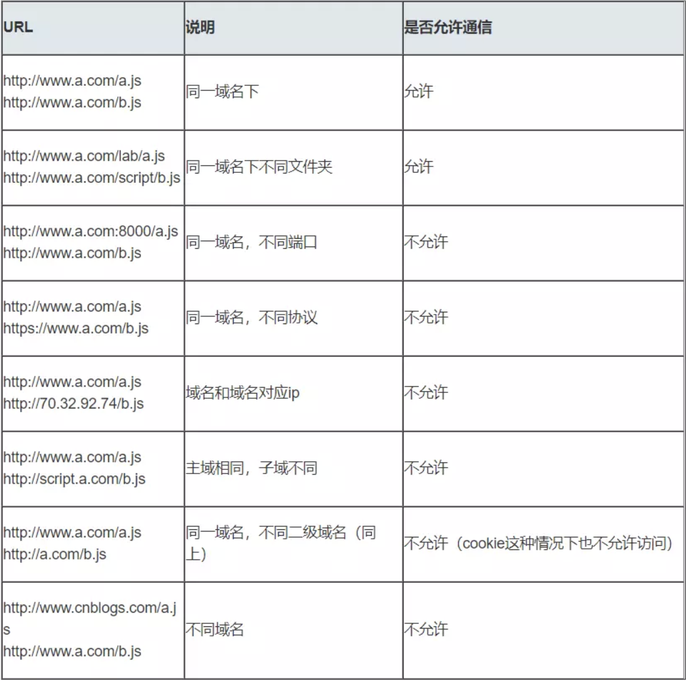

CORS：Cross-Origin Resource Sharing 跨域资源共享

SOP：Same Origin Policy 同源策略

## 域的概念、跨域的方法？

Q：为什么会有跨域问题？

A：浏览器拥有基于安全限制的同源策略SOP（同协议，同域名，同端口）。

同源策略是一种约定，它是浏览器最核心也最基本的安全功能，如果缺少了同源策略，浏览器很容易受到XSS、CSRF等攻击。所谓同源是指"协议+域名+端口"三者相同，即便两个不同的域名指向同一个ip地址，也非同源。

同源策略限制内容有：

- Cookie、LocalStorage、IndexedDB 等存储性内容
- DOM 节点
- AJAX 请求发送后，结果被浏览器拦截了

但是有三个标签是允许跨域加载资源：

- ``
- `<link href=XXX>`
- `<script src=XXX>`

Q：请求跨域了，那么请求到底发出去没有？

A：**跨域并不是请求发不出去，请求能发出去，服务端能收到请求并正常返回结果，只是结果被浏览器拦截了**。这也说明了跨域并不能完全阻止 CSRF，因为请求毕竟是发出去了。

Q：跨域有哪几种方式？每种方式都是怎样去实现跨域的？

A：JSONP 通过回调函数来进行跨域获取最终的值；CORS 通过服务端设置 Access-Control-Allow-Origin 来设置允许的域名来进行跨域，现代浏览器常用；IFrame 来进行跨域，通信可以用 postMessage；服务端代理来进行跨域，跨域的服务器不受控制。

Q：JSONP 为什么能进行跨域？有什么缺陷？

A：因为该标签有 src 属性，表示资源会下载到本地来执行，不受浏览器同源策略约束。缺陷就是 src 只能发生 get 请求，所以长度过长的请求会受到限制。

Q：CORS 请求如果服务器端设置不允许访问，浏览器能否发起跨域请求？

A：跨域请求可以正常发起，返回结果会被浏览器拦截。