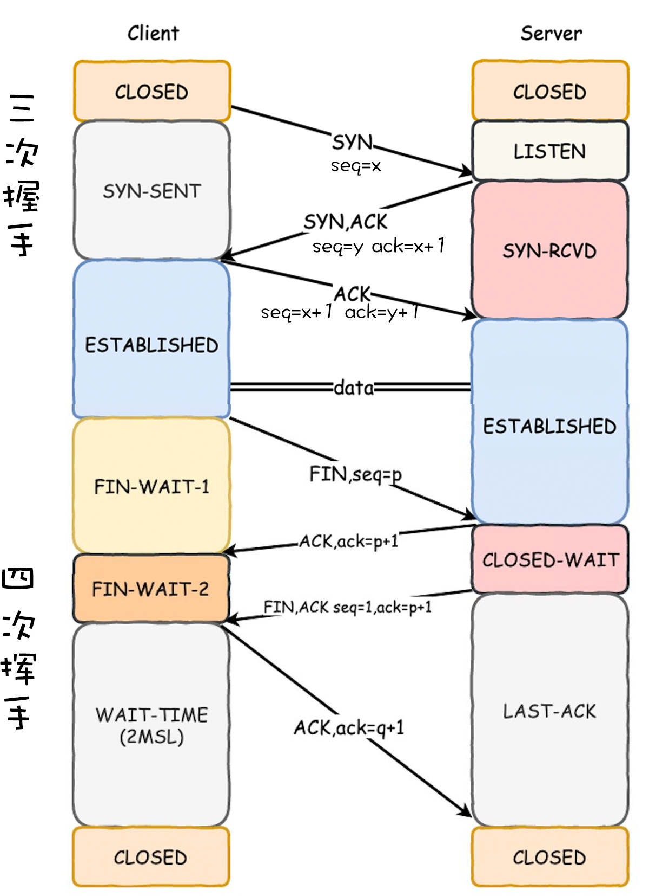

> TCP 与 UDP 的区别？

传输控制协议（Transmission Control Protocol，TCP），是一种面向连接的、可靠的、基于字节流的传输层协议。

用户数据报协议（User Datagram Protocol，UDP），是一个无连接的、简单的、面向数据报的传输层协议。

1、针对连接和速度方面。TCP是面向连接的，只能是点到点连接，速度较慢；UDP是基于非连接的，支持一对一、一对多、多对一、多对多的交互通信，速度相对较快。

2、针对实时性、可靠性和安全性。TCP的发送方要确认接收方是否收到数据报（三次握手、重新确认等）的行为会有一定的延时，实时性较差；UDP没有连接建立的过程，实时性较强。TCP协议在IP协议的基础上添加了序号机制、确认机制、超时重传机制等机制，保证了传输的可靠性，不会出现丢包或乱序；而UDP容易产生丢包。TCP连接过程较为复杂，易于黑客攻击；UDP相对安全。

3、针对开销问题。在传输相同大小的数据时，TCP头部有20字节的开销，UDP则为8字节，TCP报头比UDP复杂，因此实际包含的用户数据较少，开销较大；而UDP开销较小。

4、针对应用场合的选择。需要传输大量数据且对可靠性要求较高的情况下使用TCP；对实时性要求高，需要高速传输的情况下使用UDP；对可靠性要求低，追求效率的情况下使用UDP。

> TCP 三次握手和四次挥手？

1、第一次握手：建立连接，客户端发送连接请求报文段，将SYN位置为1，Sequence Number为x；然后，客户端进入SYN_SEND状态，等待服务器的确认；

2、第二次握手：服务器收到客户端的SYN报文段，需要对这个SYN报文段进行确认，设置Acknowledgment Number为x+1(Sequence Number+1)；同时，还要发送SYN请求信息，将SYN位置为1，Sequence Number为y；服务器端将上述所有信息放到一个报文段（即SYN+ACK报文段）中，一并发送给客户端，此时服务器进入SYN_RECV状态；

3、第三次握手：客户端收到服务器的SYN+ACK报文段。然后将Acknowledgment Number设置为y+1，向服务器发送ACK报文段，这个报文段发送完毕以后，客户端和服务器端都进入ESTABLISHED状态，完成TCP三次握手。

0、数据传输：TCP连接建立后，浏览器就可以利用HTTP／HTTPS协议向服务器发送请求进行数据传输。

1、第一次分手：主机1（可以是客户端，也可以是服务端），设置Sequence Number和Acknowledgment Number，向主机2发送一个FIN报文段；此时，主机1进入FIN_WAIT_1状态；这表示主机1没有数据要发送给主机2了；

2、第二次分手：主机2收到了主机1发送的FIN报文段，向主机1回一个ACK报文段，Acknowledgment Number为Sequence Number加1；主机1进入FIN_WAIT_2状态；主机2告诉主机1，我“同意”你的关闭请求；

3、第三次分手：主机2向主机1发送FIN报文段，请求关闭连接，同时主机2进入LAST_ACK状态；

4、第四次分手：主机1收到主机2发送的FIN报文段，向主机2发送ACK报文段，然后主机1进入TIME_WAIT状态；主机2收到主机1的ACK报文段以后，就关闭连接；此时，主机1等待2MSL后依然没有收到回复，则证明Server端已正常关闭，那好，主机1也可以关闭连接了。

> 域名解析的原理？

DNS（Domain Name System）是“域名系统”的英文缩写，是一种组织成域层次结构的计算机和网络服务命名系统，它用于TCP/IP网络，它从事将主机名或域名转换为实际IP地址的工作，是一位“翻译官”。

1、在浏览器中输入www.qq.com域名，操作系统会先检查自己本地的hosts文件是否有这个网址映射关系，如果有，就先调用这个IP地址映射，完成域名解析。

2、如果hosts里没有这个域名的映射，则查找本地DNS解析器缓存，是否有这个网址映射关系，如果有，直接返回，完成域名解析。

3、如果hosts与本地DNS解析器缓存都没有相应的网址映射关系，首先会找TCP/IP参数中设置的首选DNS服务器，在此我们叫它本地DNS服务器，此服务器收到查询时，如果要查询的域名，包含在本地配置区域资源中，则返回解析结果给客户机，完成域名解析，此解析具有权威性。

4、如果要查询的域名，不由本地DNS服务器区域解析，但该服务器已缓存了此网址映射关系，则调用这个IP地址映射，完成域名解析，此解析不具有权威性。

5、如果本地DNS服务器本地区域文件与缓存解析都失效，则根据本地DNS服务器的设置（是否设置转发器）进行查询，如果未用转发模式，本地DNS就把请求发至 “根DNS服务器”，“根DNS服务器”收到请求后会判断这个域名(.com)是谁来授权管理，并会返回一个负责该顶级域名服务器的一个IP。本地DNS服务器收到IP信息后，将会联系负责.com域的这台服务器。这台负责.com域的服务器收到请求后，如果自己无法解析，它就会找一个管理.com域的下一级DNS服务器地址(qq.com)给本地DNS服务器。当本地DNS服务器收到这个地址后，就会找qq.com域服务器，重复上面的动作，进行查询，直至找到www.qq.com主机。

6、如果用的是转发模式，此DNS服务器就会把请求转发至上一级DNS服务器，由上一级服务器进行解析，上一级服务器如果不能解析，或找根DNS或把转请求转至上上级，以此循环。不管是本地DNS服务器用是是转发，还是根提示，最后都是把结果返回给本地DNS服务器，由此DNS服务器再返回给客户机。