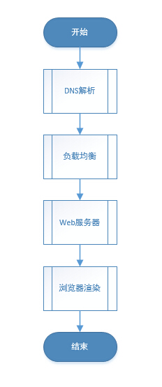

https://blog.csdn.net/weibo1230123/article/details/82899205

## 浏览器打开某网站的工作流程？

网页加载过程分成两部分：

- html(jsp/php/aspx) 页面加载(假设存在简单的Nginx负载均衡)
- css/js/image等 网页静态资源加载(假设使用CDN)

大致工作流程：

1. **DNS解析**
2. **发起TCP请求**：浏览器会选择一个大于1024的本机端口向目标IP地址的80端口发起TCP连接请求。经过标准的TCP握手流程，建立TCP连接。
3. **发起HTTP请求**：其本质是在建立起的TCP连接中，按照HTTP协议标准发送一个索要网页的请求。
4. **负载均衡**：当一台服务器无法支持大量的用户访问时，将用户分摊到两个或多个服务器上的方法叫负载均衡。常用的是Nginx负载均衡。
   - 如果我们的平台配备了负载均衡的话，前一步DNS解析获得的IP地址应该是我们Nginx负载均衡服务器的IP地址。所以，我们的浏览器将我们的网页请求发送到了Nginx负载均衡服务器上。
   - Nginx根据我们设定的分配算法和规则，选择一台后端的真实Web服务器，与之建立TCP连接、并转发我们浏览器发出去的网页请求。
   - Web服务器收到请求，产生响应，并将网页发送给Nginx负载均衡服务器。
   - Nginx负载均衡服务器将网页传递给filters链处理，之后发回给我们的浏览器。
5. **浏览器渲染**：
   - 浏览器根据页面内容，生成DOM Tree。根据CSS内容，生成CSS Rule Tree(规则树)。调用JS执行引擎执行JS代码。
   - 根据DOM Tree和CSS Rule Tree生成Render Tree(呈现树)。
   - 根据Render Tree渲染网页。
6. **网页静态资源加载**：CDN（内容分发网络），是依靠部署在各地的边缘服务器，使用户就近获取所需内容，降低网络拥塞，提高用户访问响应速度。浏览器根据url加载该url下的静态文件内容并加载。